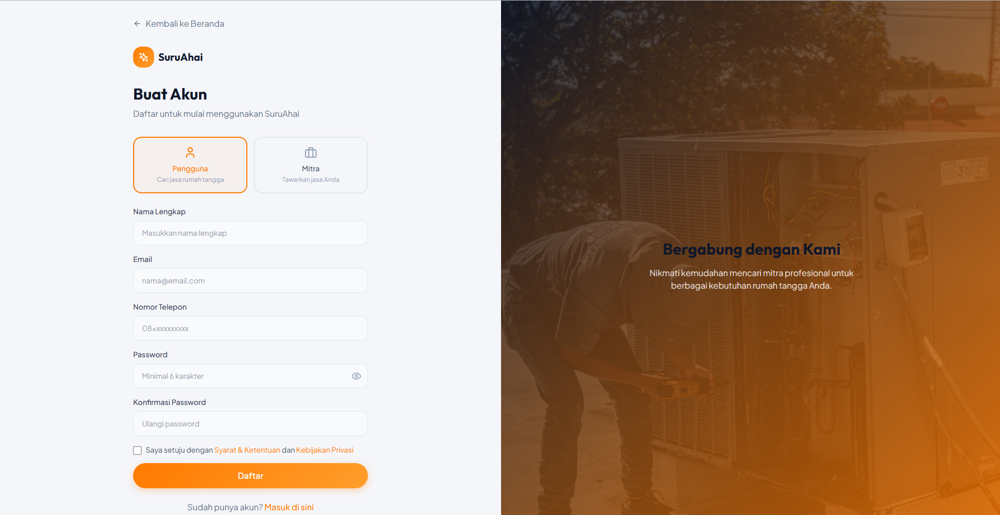
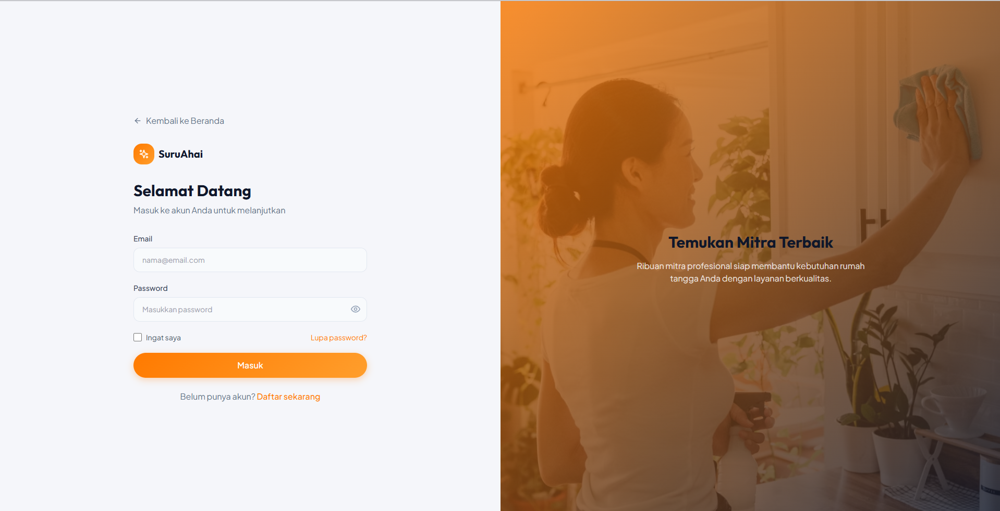

# SuruAhai 🏠

<p align="center">
  <strong>Marketplace Jasa Rumah Tangga Indonesia</strong>
</p>

<p align="center">
  Platform digital untuk memesan jasa rumah tangga — pilih mitra, negosiasi harga, bayar aman via escrow, dan lacak pesanan secara real-time.
</p>

<p align="center">
  <a href="https://suruahai.vercel.app">Live Demo</a> •
  <a href="https://github.com/FireClow/SuruAhai">GitHub</a>
</p>

---

## 📌 Ringkasan Proyek

**SuruAhai** adalah marketplace jasa rumah tangga dengan tiga peran:

| Role | Deskripsi |
|------|-----------|
| 👤 **USER** | Pelanggan membuat pesanan, memilih mitra, negosiasi harga, dan membayar |
| 🤝 **MITRA** | Penyedia jasa dengan profil per kategori, status online, dan manajemen pesanan |
| ⚙️ **ADMIN** | Verifikasi mitra, kelola pengguna, dan pantau escrow |

Berbeda dari model booking langsung, alur utama SuruAhai adalah **marketplace**: user membuat pesanan **OPEN** terlebih dahulu, lalu memilih mitra yang cocok, bernegosiasi lewat chat, dan baru melakukan pembayaran setelah harga disepakati.

---

## 🔄 Alur Pesanan (User Journey)

```text
1. Pilih layanan & isi jadwal/alamat (GPS opsional)
        ↓
2. Pesanan dibuat (status: OPEN)
        ↓
3. Halaman Pilih Mitra — filter, sort, peta jarak
        ↓
4. Pilih mitra → status: NEGOTIATING
        ↓
5. Chat + penawaran harga (terima / tolak / tawar balik)
        ↓
6. Harga disepakati → status: AWAITING_PAYMENT
        ↓
7. Bayar dari wallet (escrow) → mitra mengerjakan
        ↓
8. Selesai → rating mitra & user
```

**Status pesanan:** `OPEN` → `NEGOTIATING` → `AWAITING_PAYMENT` → `PENDING` / `CONFIRMED` → `IN_PROGRESS` → `AWAITING_USER_CONFIRMATION` → `COMPLETED` (atau `CANCELLED`)

---

## 🎯 Fitur Utama

### 👤 USER (Pelanggan)
- Registrasi & login dengan JWT
- Dashboard layanan & kategori jasa
- Booking pesanan **OPEN** (tanpa mitra awal)
- **Pilih mitra** — filter kategori, sort harga/rating/jarak, peta Leaflet
- **Chat negosiasi** + kirim gambar
- **Penawaran harga** interaktif (terima / tolak / counter)
- GPS & reverse geocode alamat (Nominatim)
- Wallet, top-up, dan pembayaran escrow
- Notifikasi real-time (WebSocket + polling)
- Rating mitra setelah pesanan selesai
- Halaman profil mitra publik

### 🤝 MITRA (Penyedia Jasa)
- Dashboard performa (pesanan, rating, pendapatan)
- **Profil jasa per kategori** (`service_offerings`: harga dasar, tools, deskripsi)
- Area layanan + lokasi GPS (auto-fill dari geocode)
- Toggle **online/offline**
- Chat & negosiasi harga dengan pelanggan
- Kelola status pesanan (terima, mulai, selesai)
- Tarik dana wallet
- Rating pelanggan (hanya terlihat mitra)
- Banner status: profil lengkap / menunggu verifikasi / siap menerima pesanan

> Mitra baru muncul di daftar pilihan pelanggan jika: **profil jasa tersimpan**, **diverifikasi admin**, **online**, dan **kategori cocok** dengan pesanan.

### ⚙️ ADMIN (Operator Platform)
- Dashboard agregasi (GMV, escrow, revenue)
- Kelola pengguna (aktif / suspend)
- **Verifikasi mitra** (wajib agar mitra tampil ke user)
- Monitor escrow & transaksi

---

## 🗂️ Kategori Jasa

| ID | Nama |
|----|------|
| `cleaning` | Kebersihan |
| `ac` | AC & Elektronik |
| `plumbing` | Pipa & Sanitasi |
| `electrical` | Listrik |
| `moving` | Pindahan |
| `renovation` | Renovasi |

---

## 💻 Tech Stack

### Frontend
- **React 18** (Create React App / `react-scripts`)
- **Tailwind CSS** — styling
- **React Router v6** — routing
- **Axios** — HTTP client
- **Leaflet + react-leaflet** — peta mitra & lokasi
- **Lucide React** — ikon
- **Sonner** — toast notifications

**Dev server:** `http://localhost:3000`  
**Deployment:** [Vercel](https://vercel.com)

### Backend
- **FastAPI** + **Uvicorn**
- **PyMongo** — MongoDB
- **JWT** (python-jose) — autentikasi
- **Passlib + Bcrypt** — hash password
- **WebSocket** — update pesanan real-time

**Dev server:** `http://127.0.0.1:8001`  
**Deployment:** Replit / VPS

### Database
- **MongoDB Atlas** (atau instance lokal)
- Collections utama: `users`, `services`, `orders`, `offers`, `messages`, `wallets`, `notifications`, `reviews`, `ratings`

---

## 🏗️ Arsitektur

```text
┌─────────────────────────────────────────┐
│     Frontend (React — Vercel)           │
│  Dashboard • Booking • Pilih Mitra      │
│  Chat • Negosiasi • Peta • Notifikasi    │
└──────────────────┬──────────────────────┘
                   │ REST + WebSocket
┌──────────────────▼──────────────────────┐
│     Backend (FastAPI — port 8001)       │
│  Auth • Orders • Offers • Wallet        │
└──────────────────┬──────────────────────┘
                   │
┌──────────────────▼──────────────────────┐
│        MongoDB Atlas                    │
└─────────────────────────────────────────┘
```

---

## 📁 Struktur Folder

```text
SuruAhai/
├── frontend/
│   ├── src/
│   │   ├── pages/           # Landing, Dashboard, Booking, ChooseMitra, OrderDetail, ...
│   │   ├── components/      # OrderMap, UI helpers
│   │   ├── contexts/        # AuthContext
│   │   └── services/        # api.js
│   ├── .env.local           # REACT_APP_BACKEND_URL (jangan commit)
│   └── package.json
├── backend/
│   ├── server.py            # API utama
│   ├── seed_mitras.py       # Seed mitra dummy (16 akun)
│   ├── init_db.py
│   ├── test_marketplace_flow.py
│   ├── start.ps1            # Start API di Windows (port 8001)
│   ├── requirements.txt
│   └── .env                 # MONGO_URL, JWT_SECRET (jangan commit)
├── docs/
│   ├── BACKEND_Run.md
│   └── DEPLOYMENT.md
└── README.md
```

---

## ⚙️ Prerequisites

- **Python 3.10+** (rekomendasi 3.11)
- **Node.js 18+** & npm
- **MongoDB Atlas** account (atau MongoDB lokal)
- **Git**

---

## 🚀 Menjalankan Lokal

### 1. Setup Backend

```powershell
cd backend

python -m venv .venv
.venv\Scripts\activate          # Windows
# source .venv/bin/activate   # macOS/Linux

pip install -r requirements.txt
```

Buat `backend/.env` (salin dari `env.example`):

```env
MONGO_URL=mongodb+srv://...
DB_NAME=suruahai
JWT_SECRET=your-secret-key
JWT_ALGORITHM=HS256
ACCESS_TOKEN_EXPIRE_MINUTES=1440
```

Jalankan API:

```powershell
# Windows (recommended)
.\start.ps1

# Atau manual
python -m uvicorn server:app --host 127.0.0.1 --port 8001 --reload
```

Backend: **http://127.0.0.1:8001**

### 2. Setup Frontend

Terminal baru:

```powershell
cd frontend
npm install
```

Buat `frontend/.env.local`:

```env
REACT_APP_BACKEND_URL=http://127.0.0.1:8001
```

Jalankan:

```powershell
npm start
```

Frontend: **http://localhost:3000**

### 3. Seed Data

```powershell
# Akun demo default (admin, user, mitra)
curl -X POST http://127.0.0.1:8001/api/seed

# Mitra dummy tambahan (16 akun beragam kategori & harga)
cd backend
python seed_mitras.py
```

---

## 👤 Akun Demo

| Role | Email | Password | Keterangan |
|------|-------|----------|------------|
| Admin | admin@suruahai.com | admin123 | Verifikasi mitra |
| User | user@suruahai.com | user123 | Buat & kelola pesanan |
| Mitra | mitra@suruahai.com | mitra123 | Sudah verified, cleaning + AC |

**Tips testing end-to-end:**
1. Login **user** → booking layanan → pesanan OPEN
2. Pilih mitra di halaman **Pilih Mitra**
3. Negosiasi harga di **Detail Pesanan**
4. Login **admin** → verifikasi mitra baru jika perlu

---

## 📡 API Endpoints (Ringkas)

**Base URL lokal:** `http://127.0.0.1:8001`

| Grup | Endpoint penting |
|------|------------------|
| Health | `GET /api/health` |
| Auth | `POST /api/auth/register`, `POST /api/auth/login`, `GET /api/auth/me` |
| Services | `GET /api/services`, `GET /api/services/categories/list` |
| Mitra | `GET /api/mitra/list`, `PUT /api/mitra/profile`, `PUT /api/mitra/toggle-online` |
| Orders | `POST /api/orders` (OPEN), `GET /api/orders/{id}/mitras`, `POST /api/orders/{id}/select-mitra` |
| Chat | `GET/POST /api/orders/{id}/messages` |
| Offers | `GET/POST /api/orders/{id}/offers`, `POST /api/offers/{id}/accept`, `POST /api/offers/{id}/reject` |
| Payment | `POST /api/orders/{id}/pay`, `PUT /api/orders/{id}/status` |
| Wallet | `GET /api/wallet`, `POST /api/wallet/topup`, `POST /api/wallet/withdraw` |
| Rating | `POST /api/ratings/mitra`, `POST /api/ratings/user` |
| Notifikasi | `GET /api/notifications`, `POST /api/notifications/read-all` |
| Real-time | `WS /api/ws/orders/{order_id}` |
| Admin | `GET /api/admin/dashboard`, `PUT /api/admin/mitra/{id}/verify` |
| Seed | `POST /api/seed` |

---

## 🧪 Testing

```powershell
# Integration test umum
python backend_test.py

# Test alur marketplace (OPEN → pilih mitra → negosiasi)
cd backend
python test_marketplace_flow.py
```

Custom base URL (PowerShell):

```powershell
$env:API_BASE_URL="http://127.0.0.1:8001"; python backend_test.py
```

---

## 🌐 Deployment

### Frontend (Vercel)

1. Import repo GitHub → root folder `frontend`
2. Set environment variable:
   ```env
   REACT_APP_BACKEND_URL=https://your-backend-url
   ```
3. Deploy → live di `https://suruahai.vercel.app`

### Backend (Replit / VPS)

1. Deploy folder `backend`
2. Set `.env` (`MONGO_URL`, `JWT_SECRET`, dll.)
3. Jalankan: `uvicorn server:app --host 0.0.0.0 --port 8001`

### Database (MongoDB Atlas)

1. Buat cluster & database user
2. Whitelist IP (atau `0.0.0.0/0` untuk dev)
3. Masukkan connection string ke `MONGO_URL`

Detail lebih lanjut: [`docs/DEPLOYMENT.md`](./docs/DEPLOYMENT.md) dan [`docs/BACKEND_Run.md`](./docs/BACKEND_Run.md)

---

## 🐛 Troubleshooting

| Masalah | Solusi |
|---------|--------|
| Port 8001 sudah dipakai (Windows) | Jalankan `backend/start.ps1` — script membersihkan proses stale |
| Frontend tidak connect ke API | Cek `REACT_APP_BACKEND_URL` di `.env.local`, restart `npm start` |
| Mitra tidak muncul saat pilih mitra | Pastikan mitra **verified** (admin), **online**, dan punya **kategori yang sama** |
| MongoDB timeout | Cek whitelist IP Atlas & credential di `.env` |
| `422` saat buat pesanan | Pastikan backend terbaru jalan; pesanan OPEN tidak butuh `mitra_id` |

---

## 📸 Screenshots & Mockups
 
### 🎨 UI Components
  
#### Authentication
Register page

Login page

#### User Dashboard
Home / Browse services
Service detail
Create booking
Order history
Wallet & transactions
Profile

#### Mitra Dashboard
Dashboard stats
Incoming orders
Order management
Earnings & wallet
Profile & verification

#### Admin Dashboard
Overview stats
User management
Mitra verification
Transaction monitoring
Reports

## 🚦 Status Development

### ✅ Selesai
- Marketplace flow (OPEN order → pilih mitra)
- Profil mitra per kategori (`service_offerings`)
- Chat negosiasi + penawaran harga
- GPS, geocoding, peta jarak mitra
- WebSocket & notifikasi
- Rating dua arah (mitra publik, user privat untuk mitra)
- Escrow wallet & pembayaran simulasi
- Admin verifikasi mitra

### 🗺️ Roadmap
- [ ] Payment gateway nyata (Midtrans/Xendit)
- [ ] Email & verifikasi email
- [ ] Upload dokumen verifikasi mitra
- [ ] Password reset
- [ ] Mobile app (React Native)
- [ ] Multi-language (ID/EN)

---

## 👥 Tim

| Nama | NIM |
|------|-----|
| BRANDON ALEXANDER | 2802465484 |
| GIOVAN PRILSKY WONGSO | 2802463812 |
| KENJI LAWRENCE | 2802463440 |
| NICHOLAS DRIYADIS TJOE | 2802461321 |
| YOEL ABRAHAM UKTOLSEJA | 2802463775 |

---

## 📄 License

Proyek akademik — lihat file `LICENSE` jika tersedia.

---

<p align="center">
  Made with ❤️ by SuruAhai Team
</p>
